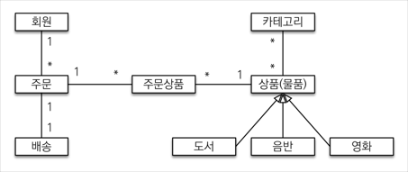
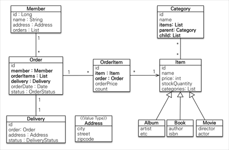
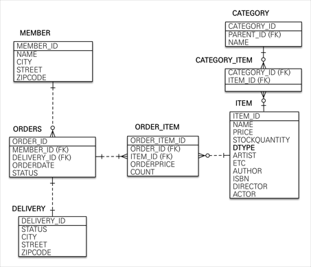

# 실전 스프링부트 JPA 1
*기능*
- 회원기능
	- 회원 등록
	- 회원 조회
- 상품기능
	- 상품 등록
	- 상품 수정
	- 상품 조회
- 주문기능
	- 상품 주문
	- 주문 내역 조회
	- 주문 취소
- 기타
	- 상품은 재고 관리가 필요하다.
	- 상품의 종류는 도서, 음반, 영화가 있다.
	- 상품을 카테고리로 구분할 수 있다.
	- 상품 주문시 배송 정보를 입력할 수 있다.



회원, 주문, 상품 관계
: 회원은 여러 상품 주문, 한 번 주문할 때 여러 상품 선택 가능 - 다대다
주문상품을 만들어서 다대일 관계로



회원테이블



### 연관관계 매핑 분석
회원과 주문
: 일대다, 다대일의 양방향 관계로 연관관계 주인 필요.
외래키가 있는 곳을 연관관계의 주인으로 Order.member를 ORDERS.MEMBER_ID 외래키와 매핑

주문상품과 주문
: 다대일 양방향 관계. 외래키가 주문상품에 있으므로 주문상품이 연관관계 주인

주문상품과 상품
: 다대일 단방향 관계.

주문과 배송
: 일대일 단방향 관계.

카테고리와 상품 : 다대다 양방향 관계. @ManyToMany

> 외래 키가 있는 곳을 연관관계의 주인으로 정하기.  
> 단순히 외래키를 누가 관리하느냐의 문제  

## 엔티티 클래스
- 실무에서는 가급적 Getter 열고 Setter 닫기
- Setter 대신에 변경 지점이 명확해지도록 변경을 위한 비즈니스 메서드를 별도로 제공
- 값 타입은 변경 불가능하게 설계해야함
@Setter를 제거하고, 생성자에서 값을 모두 초기화하도록
JPA 스펙상 엔티티나 임베디드 타입은 자바 기본생성자를 public or protected로 둬야함.


## 엔티티 설계시 주의점
### 엔티티에는 가급적 Setter를 사용하지 않도록
- setter가 모두 열려있으면 변경 포인트가 많아 유지보수가 어려움

### 모든 연관관계는 지연로딩으로 설정!
- 즉시로딩은 예측이 어렵고, 어떤 SQL이 실행될지 추적이 어려움. 특히, JPQL을 실행할 때 N+1 문제가 자주 발생
- 연관된 엔티티를 함께 DB에서 조회해야 하면, fetch join 또는 엔티티 그래프 기능을 사용한다.
- @XToOne 관계는 기본이 즉시로딩으므로 지연로딩으로

### 컬렉션은 필드에서 초기화
- null 문제에서 안전
- 하이버네이트는 엔티티를 영속화 할 때, 컬렉션을 감싸서 하이버네이트가 제공하는 내장 컬렉션으로 변경.

### 테이블, 컬럼명 생성 전략
- 하이버네티으 기존 구현 : 엔티티의 필드명을 그대로 테이블 명으로 사용
- 스프링 부트 신규 설정 (엔티티(필드) -> 테이블(컬럼))
	1. 카멜 케이스 -> 언더스코어
	2. . -> _
	3. 대문자 -> 소문자

## 변경 감지와 병합
*준영속 엔티티*
영속성 컨텍스트가 더는 관리하지 않는 엔티티.

*준영속 엔티티를 수정하는 2가지 방법*
- 변경 감지 기능 사용
- 병합(merge) 사용

### 변경 감지 기능 사용
```
@Transactional
void update(Item itemParam) {
	Item findItem = em.find(Item.class, itemParam.getId();
	findItem.setPrice(item.Param.getPrice());
}
```
영속성 컨텍스트에서 엔티티를 다시 조회한 후에 데이터를 수정하는 방법
트랜잭션 안에서 엔티티를 다시 조회, 변경할 값 선택 -> 트랜잭션 커밋 시점에 변경 감지(Dirty Checking)이 동작해서 데이터베이스에서 UPDATE SQL 실행

### 병합 사용
병합은 준영속 상태의 엔티티를 영속 상태로 변경할 때 사용하는 기능이다.
```
@Transactional
void update(Item itemParam) {
	Item mergeItem = em.merge(item);
}
```
*병합 동작 방식*
1. 준영속 엔티티의 식별자 값으로 영속 엔티티를 조회한다.
2. 영속 엔티티의 값을 준영속 엔티티의 값으로 모두 교체한다.(병합)
3. 트랜잭션 커밋 시점에 변경 감지 기능이 동작해서 데이터베이스에 UPDATE SQL이 실행

> 주의 : 변경 감지 기능을 사용하면 원하는 속성만 선택해서 사용할 수 있지만, 병합을 사용하면 모든 속성이 변경된다.
> 병합 시 값이 없으면 null로 업데이트 할 위험도 있다.(병합은 모든 필드 교체)

*변경할 때도 entity에서 변경할 수 있도록 메서드 만들어야함*

### 엔티티를 변경할 때는 항상 변경감지 사용!
- 컨트롤러에서 어설프게 인티티 생성 X
- 트랜잭션이 있는 서비스 계층에 식별자와 변경할 데이터를 명확하게 전달.(파라미터 or DTO)
- 트랜잭션이 있는 서비스 계층에서 영속 상태 엔티티 조회하고, 엔티티 데이터 직접 변경
- 트랜잭션 커밋 시점 변경감지 실행됨.


# 실전 스프링부트 JPA2
## 등록
- Entity를 API 에서 사용하지 않도록 해야함.
- API 스펙을 위한 별도의 DTO 필요.
- Entity를 외부에 노출하면 안됨.
- DTO에서 @NotEmpty등 Validation 체크를 해야함.
- Entity가 바뀌어도 API spec이 바뀌지 않도록
- entity와 presentation layer 분리

> API는 꼭 Entity를 직접 사용하지 않고 별도의 DTO 사용하여 개발

## 수정
- 수정은 되도록 변경 감지 사
- command와 query를 분리
